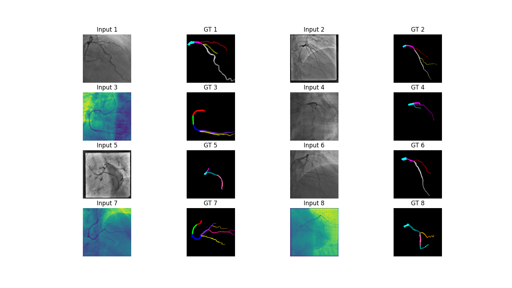

# ARCADE dataset for PyTorch



This package contains a PyTorch dataset for [ARCADE](https://zenodo.org/records/8386059) from
"Dataset for Automatic Region-based Coronary Artery Disease Diagnostics Using X-Ray Angiography Images". The dataset can be used for binary and semantic segmentation as well as stenosis detection.

## Installation

```bash
pip3 install git+https://github.com/laudominik/torch-arcade
```

## Usage example

```python
from torch_arcade import ARCADEBinarySegmentation

ds = ARCADEBinarySegmentation(
    "dataset/",
    image_set="train",
    download="true"
)
img, mask = ds[0]
```

## Dataset list
- `ARCADEBinarySegmentation`
    - input: image 
    - label: image binary mask (shape `512x512x1`)
- `ARCADESemanticSegmentation`
    - input: image
    - label: image semantic mask (shape `512x512x26`)
- `ARCADEArteryClassification`
    - input: image binary mask
    - label: 0 - right artery, 1 - left artery
- `ARCADESemanticSegmentationBinary`
    - input: image binary mask
    - label: image semantic mask (shape `512x512x26`)
- `ARCADEStenosisDetection`
    - input: image
    - label: coco labels for the stenoses
- `ARCADEStenosisSegmentation`
    - input: image
    - label: binary mask (0, 1)
